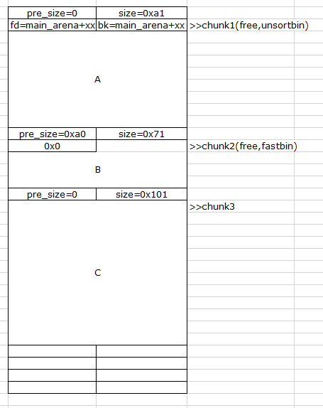
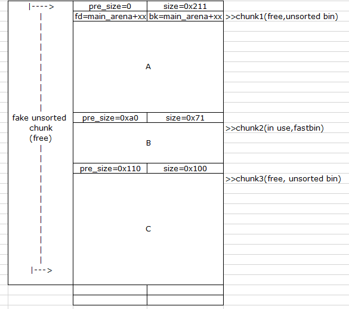
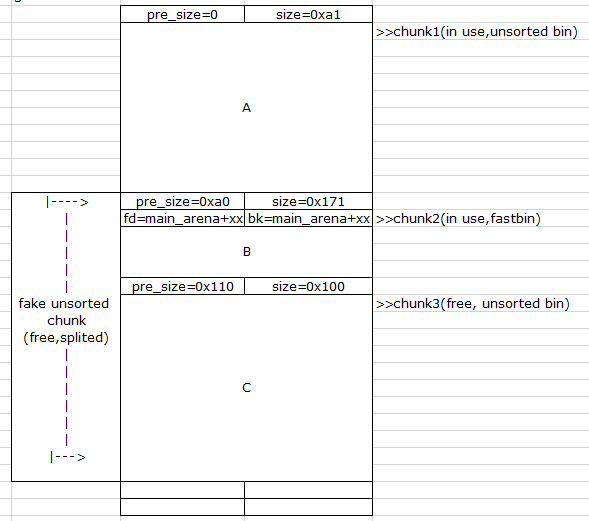

## off-by-one-null
一种uaf, 能通过溢出一个字节'\x00'，完成地址泄露，有限地址读写能力....一句话说明白有点复杂，也有可能不严谨...<br>
## 前置知识
一个非常全的堆的知识集合，虽然是英文的，里面一些此次会用到的可能会拿出来详细讲讲 https://dangokyo.me/2017/12/05/introduction-on-ptmalloc-part1/
## 题目分析

### 漏洞点
在new的时候读内容的时候，最后多写了一个\x00<br>

## 利用思路
第一部分，如何利用off-by-one-null泄露libc基址；第二部分，利用off-by-one-null达成有限能力的读写，来进行fastbin attack
### 泄露libc基址（用memo_note举例）
1.第一步申请三个堆块<br>

chunk1和chunk3是smallbin（因为free small bin的时候，都会先放入unsorted bin中，所以图中为unsorted bin<br>
chunk2是fastbin<br>
```
new(0x90, 'A'*0x90)
new(0x68, 'B'*0x68)
new(0xf0, 'C'*0xf0)
```
<br>

2.free(chunk1) + free(chunk2), 各类bin中只有fastbin是单链表，剩下的small bin,unsorted bin,large bin都是双向链表<br>
所以在free(chunk1)的时候，chunk1的fd和bk的地方会指向main_arena<br>
```
delete(0)
delete(1)
```
<br>

3.用chunk2，off-by-one-null写chunk3的header<br>
1>malloc(0x68)只会申请0x60个字节，但是会占用下一个chunk的pre_size的字段<br>
2>chunk的size因为一定是8的整数倍（64位），所以低三位是标志位，其中最低位是in use标志位，如果为0表示前一个chunk是处于free的状态
3>chunk3的size必须要为0x101，因为off-by-one-null会把一个字节清0，即\x00，如果是0xa0的话，0xa0会被清0,如果是0x101，只会把0x01清0，变成0x100<br>
所以这里我们可以只malloc(0x68)，然后可以写chunk3的pre_size，让pre_size的大小可以覆盖到整个chunk1，并且把size的最低位in use位置0<br>
pre_size的计算方法是 0x60(chunk2的data)+0x10(chunk2的header)+0xa0(chunk1)=0x110<br>
```
new(0x68,'B'*0x60+'\x10\x01'.ljust(8,'\x00')) #new idx=0
```
<br>

4.free(chunk3)
我们修改了两个地方：<br>
1>chunk3的pre_size，让pre_size包含chunk1<br>
2>chunk3size的低3位的标志位，其中最低位是前一个chunk是否in use的标志位，为0的话代表着前一个chunk处于free的状态<br>
这两个修改带来的效果是，free(chunk3)的时候<br>
系统根据chunk3size中的in use位判断前面的chunk是free的<br>
并且根据chunk3的pre_size来判断前一个free块的大小,来进行空块合并，然后放入unsorted bin里面<br>
此时chunk1 size的来源就是 chunk3的size(0x100)+pre_size(0x110),刚好能将chunk1+chunk2覆盖掉
```
delete(2)
```
<br>

5.切割unsorted bin。
如果有不明白的可以先看看图片中这一步的结果<br>
具体操作：申请一个和chunk1一样大小的块，然后就会将unsorted bin中的块切割<br>
和chunk1一样大小的chunk就被申请出去，那么切割剩下的fake unsorted chunk的fd和bk就刚好落在chunk2的data区域<br>
这个时候chunk2的状态时in use,就可以通过show(chunk2)将fake unsorted chunk的fd读取出来，即泄露了libc基址<br>
关于unsorted bin切割
1>malloc的时候unsortedbin被切割要满足几个条件：(英文为原文，中文为我翻译的...所以中文可能不准)<br>
(1) The requested size is in small range.（申请的chunk大小时smallbin）<br>
(2) This chunk is the only chunk in unsorted bin.（被切割的chunk是unsortedbin唯一的chunk）<br>
(3) This chunk is also the last remainder chunk.（这个chunk必须是最近请求的一个reaminder chunk）<br>
(4) The remaining size after split is large enough.（切割后的剩余的大小要足够的大（我猜至少要属于smallbin领域））<br>

2>if a small request, try to use last remainder if it is the<br>
  only chunk in unsorted bin.  This helps promote locality for<br>
  runs of consecutive small requests. This is the only<br>
  exception to best-fit, and applies only when there is<br>
  no exact fit for a small chunk<br>
一个小的chunk申请来了，如果unsortedbin上面只有一个chunk，那么就会尝试使用last remainder机制。这会有效的提升连续的小的chunk申请的效率。在没有对申请的small chunk有完全合适的chunk的时候，这可能是最好的结果
```
new(0x90,'a'*0x8f)
```
<br>


